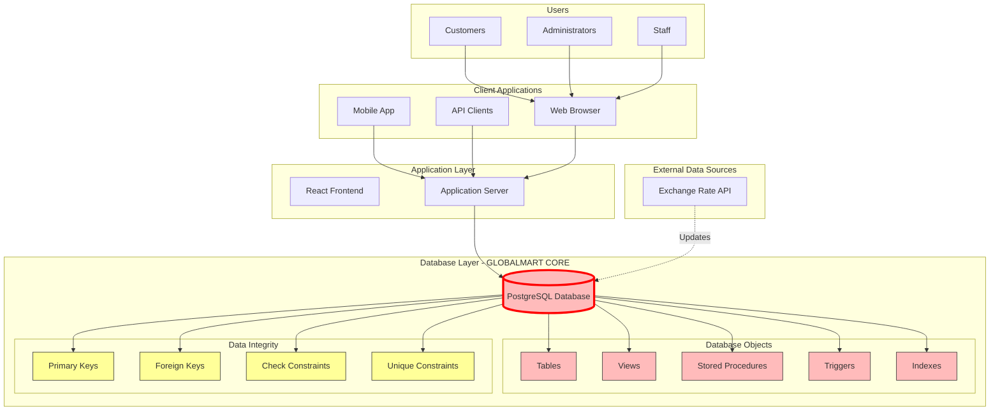
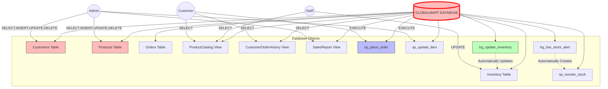
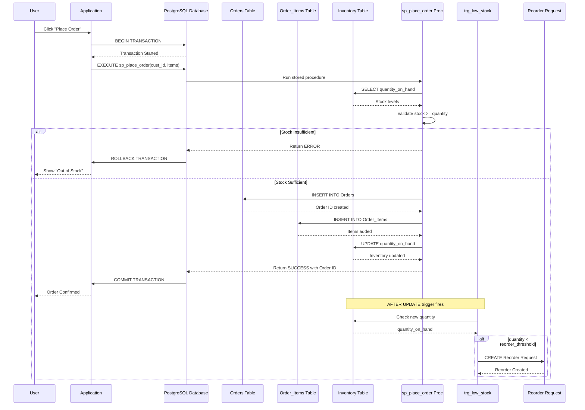

### GLOBALMART
### E-Commerce Web Application
### System Overview and Requirements Documentation

### 1. Introduction
### 1.1 Background
With the rapid growth of the internet and digital technologies, online shopping has become an important part of modern commerce. E-commerce platforms allow customers to browse products, compare prices, and make purchases without physically visiting a store.

Businesses also benefit from e-commerce systems by expanding their market reach and improving customer engagement.

GlobalMart is designed as a web-based e-commerce application that enables customers to purchase products online while allowing administrators to manage products, categories, and customer orders efficiently.

### 1.2 Purpose of the System
The purpose of GlobalMart is to develop a reliable and user-friendly e-commerce platform where users can browse products, add items to a shopping cart, and place orders online.

The system also provides administrative tools to manage product listings, categories, and customer orders.

### 1.3 Problem Statement
Traditional shopping methods require customers to physically visit stores to view and purchase products. This process can be time-consuming and inconvenient, especially when customers want to compare products from multiple stores.

Additionally, many small businesses struggle to reach a larger audience without having an online presence.

The GlobalMart platform addresses these issues by providing an online marketplace that allows businesses to sell products digitally while offering customers a convenient and accessible shopping experience.

### 2. Project Objectives
The main objectives of the GlobalMart system are:
- Design and develop a user-friendly online shopping platform
- Allow users to create accounts and securely log into the system
- Enable customers to browse and search for products
- Provide a shopping cart system for managing selected items
- Allow customers to place and track orders
- Provide administrators with tools to manage products, categories, and customer orders

### 3. Scope of the System
The GlobalMart system includes functionalities for both customers and administrators.

### 3.1 Customer Functions
Customers will be able to:
- Register a new account
- Log into the platform
- Browse product categories
- Search for products
- Add products to a shopping cart
- Place orders
- View order history

### 3.2 Administrator Functions
Administrators will be able to:
- Add new products
- Update existing product information
- Remove products from the system
- Manage product categories
- View and manage customer orders
- Manage user accounts

### 4. Functional Requirements
Functional requirements describe the operations the system must perform.
- The system shall allow users to create a new account.
- The system shall allow registered users to log into the platform.
- The system shall allow users to browse available products.
- The system shall allow users to search for products by name or category.
- The system shall allow users to add products to a shopping cart.
- The system shall allow users to update or remove items from the cart.
- The system shall allow users to place orders.
- The system shall allow administrators to add, edit, and delete product information.
- The system shall allow administrators to view and manage customer orders.

### 5. Non-Functional Requirements
### 5.1 Performance
The system should load pages quickly and handle multiple users simultaneously without delays.

### 5.2 Security
The system must protect user information and ensure secure authentication. User passwords should be encrypted before being stored in the database.

### 5.3 Usability
The system interface should be simple, intuitive, and easy for users to navigate.

### 5.4 Reliability
The system should operate continuously with minimal downtime.

### 6. System Actors
### 6.1 Customer
A customer interacts with the system to browse and purchase products.
Customer actions include:
- Registering an account
- Logging into the system
- Browsing products
- Adding items to a cart
- Placing orders

### 6.2 Administrators
The administrator manages the overall operation of the system.
Administrator responsibilities include:
- Managing products
- Managing categories
- Monitoring customer orders
- Managing user accounts


### 2. Database-Centric System Architecture

### Overview
This document focuses on the database-centric architecture of GlobalMart, showing how users and applications interact with the database system we are designing in class. The architecture emphasizes the database as the core component, with all other elements serving as interfaces to the data.

---

### High-Level Architecture Diagram



### Architecture Description

| Layer | Components | Database-Centric Role |
|-------|------------|----------------------|
| **Users** | Customers, Admins, Staff | Different roles with different database permissions |
| **Client Apps** | Web, Mobile, API | Interfaces that send SQL/queries or call stored procedures |
| **Application Layer** | React, Node.js | Thin layer that primarily passes data to/from database |
| **Database Core** | PostgreSQL | **Central component** - All business logic, data integrity, and rules enforced here |
| **External** | Currency API | Feeds data into database via scheduled jobs/triggers |

**Key Design Principle:** The database is the heart of the system. It enforces:
- Data integrity (PK, FK, Constraints)
- Business rules (Check constraints, Triggers)
- Complex calculations (Stored Procedures)
- Performance (Indexes)
- Security (Views, User permissions)

---

## 2.1 Database-Centric Use Case Diagram

### How Users Interact with Database Objects



### Database Object Access Matrix

| Database Object | Customer | Admin | Staff | Automatic (Trigger) |
|-----------------|----------|-------|-------|---------------------|
| Customers Table | No access | Full CRUD | No access | No |
| Products Table | SELECT only | Full CRUD | SELECT only | No |
| Orders Table | SELECT own only | Full CRUD | SELECT all | No |
| Inventory Table | No access | Full CRUD | UPDATE only | Yes (Triggers) |
| ProductCatalog View | SELECT | SELECT | SELECT | No |
| CustomerOrderHistory View | SELECT own | SELECT all | SELECT all | No |
| SalesReport View | No access | SELECT | No access | No |
| sp_place_order | EXECUTE | EXECUTE | No | No |
| sp_reorder_stock | No | EXECUTE | EXECUTE | Yes (Trigger) |
| sp_update_tiers | No | EXECUTE | No | Yes (Scheduled) |
| trg_update_inventory | - | - | - | ON Order INSERT |
| trg_low_stock_alert | - | - | - | ON Inventory UPDATE |

---

## 2.2 Database-Focused Activity Diagram

### Order Processing with Database Transactions

```mermaid
graph TD
    Start([Customer Starts]) --> A[Browse Products]
    A --> B[Add to Cart]
    B --> C{Ready to Checkout?}
    C -->|No| A
    C -->|Yes| D[Click Place Order]
    
    subgraph "DATABASE TRANSACTION - ACID Properties"
        E[Begin Transaction]
        E --> F[Call Stored Procedure: sp_place_order]
        
        F --> G[Check Inventory Table<br/>quantity_on_hand >= order_qty]
        G --> H{Stock Available?}
        H -->|No| I[Rollback Transaction<br/>Return Error]
        
        H -->|Yes| J[Insert into Orders Table]
        J --> K[Insert into Order_Items Table]
        K --> L[Update Inventory Table<br/>quantity_on_hand = quantity_on_hand - order_qty]
        
        L --> M{Any Error?}
        M -->|Yes| I
        
        M -->|No| N[Commit Transaction]
    end
    
    I --> O[Show "Out of Stock" Message]
    O --> A
    
    N --> P[Trigger: trg_low_stock_alert runs automatically]
    P --> Q{Inventory Below Threshold?}
    Q -->|Yes| R[Auto-create Reorder Request]
    Q -->|No| S[Send Order Confirmation]
    R --> S
    
    S --> T[Show Order Success Page]
    T --> V([End])
    
    style Start fill:#9f9,stroke:#333,stroke-width:2px
    style V fill:#f99,stroke:#333,stroke-width:2px
    style E fill:#ff9,stroke:#333,stroke-width:2px
    style N fill:#ff9,stroke:#333,stroke-width:2px
    style I fill:#f99,stroke:#333,stroke-width:2px
    style P fill:#bfb,stroke:#333,stroke-width:2px
```

### Database Transaction Explanation

| Step | Database Action | ACID Property | Tables Involved |
|------|----------------|---------------|-----------------|
| 1 | BEGIN TRANSACTION | Atomicity starts | - |
| 2 | Check inventory | Consistency check | Inventory |
| 3 | INSERT into Orders | Atomic operation | Orders |
| 4 | INSERT into Order_Items | Atomic operation | Order_Items |
| 5 | UPDATE Inventory | Atomic operation | Inventory |
| 6 | If error, ROLLBACK | Atomicity preserved | All |
| 7 | If success, COMMIT | Durability achieved | All |
| 8 | Trigger fires automatically | Business rule enforcement | Inventory |

---

## 2.3 Database-Centric Sequence Diagram

### Order Placement - Database Object Interactions




### Database Object Roles

| Database Object | Type | Role in Sequence |
|-----------------|------|------------------|
| **Orders Table** | Table | Stores order header information |
| **Order_Items Table** | Table | Stores individual line items |
| **Inventory Table** | Table | Tracks stock levels, updated by trigger |
| **sp_place_order** | Stored Procedure | Contains all order logic, runs in transaction |
| **trg_low_stock** | Trigger | Automatically fires after inventory update |
| **Database Transaction** | ACID | Ensures all-or-nothing order placement |

---

## 2.4 Database Component Diagram

### Components of the GlobalMart Database System

```mermaid
graph TB
    subgraph "DATABASE MANAGEMENT SYSTEM"
        DB[PostgreSQL Database Engine]
        
        subgraph "SCHEMA OBJECTS"
            direction TB
            T[Tables]
            V[Views]
            IX[Indexes]
            SQ[Sequences]
        end
        
        subgraph "PROGRAMMABILITY"
            SP[Stored Procedures]
            FN[Functions]
            TR[Triggers]
        end
        
        subgraph "DATA INTEGRITY"
            PK[Primary Keys]
            FK[Foreign Keys]
            CK[Check Constraints]
            UQ[Unique Constraints]
            DF[Default Values]
        end
        
        subgraph "SECURITY"
            USR[Users/Roles]
            PRM[Permissions]
            VW[Security Views]
        end
    end
    
    subgraph "TABLES DETAIL"
        CUST[Customers]
        PROD[Products]
        ORD[Orders]
        ORDI[Order_Items]
        INV[Inventory]
        WH[Warehouses]
        CURR[Currencies]
        EXR[Exchange_Rates]
        TIER[Customer_Tiers]
        ATT[Attributes]
        PRODA[Product_Attributes]
    end
    
    subgraph "VIEWS DETAIL"
        V1[CustomerOrderHistory]
        V2[ProductCatalog]
        V3[InventoryStatus]
        V4[MonthlySales]
        V5[CustomerTierBenefits]
    end
    
    subgraph "PROCEDURES DETAIL"
        P1[sp_place_order]
        P2[sp_reorder_stock]
        P3[sp_update_customer_tiers]
        P4[sp_apply_exchange_rates]
    end
    
    subgraph "TRIGGERS DETAIL"
        T1[trg_update_inventory]
        T2[trg_low_stock_alert]
        T3[trg_update_lifetime_value]
        T4[trg_audit_log]
    end
    
    DB --> T
    DB --> V
    DB --> IX
    DB --> SQ
    DB --> SP
    DB --> FN
    DB --> TR
    DB --> PK
    DB --> FK
    DB --> CK
    DB --> UQ
    DB --> DF
    DB --> USR
    DB --> PRM
    DB --> VW
    
    T --> CUST
    T --> PROD
    T --> ORD
    T --> ORDI
    T --> INV
    T --> WH
    T --> CURR
    T --> EXR
    T --> TIER
    T --> ATT
    T --> PRODA
    
    V --> V1
    V --> V2
    V --> V3
    V --> V4
    V --> V5
    
    SP --> P1
    SP --> P2
    SP --> P3
    SP --> P4
    
    TR --> T1
    TR --> T2
    TR --> T3
    TR --> T4
    
    style DB fill:#fbb,stroke:#f00,stroke-width:4px
    style T fill:#fbb,stroke:#333,stroke-width:1px
    style SP fill:#bbf,stroke:#333,stroke-width:1px
    style TR fill:#bfb,stroke:#333,stroke-width:1px
    style V fill:#bff,stroke:#333,stroke-width:1px
```



### Component Inventory

| Component Category | Components | Count | Purpose |
|-------------------|------------|-------|---------|
| **Tables** | Customers, Products, Orders, Order_Items, Inventory, Warehouses, Currencies, Exchange_Rates, Customer_Tiers, Attributes, Product_Attributes | 11 | Core data storage |
| **Views** | CustomerOrderHistory, ProductCatalog, InventoryStatus, MonthlySales, CustomerTierBenefits | 5 | Simplified data access |
| **Stored Procedures** | sp_place_order, sp_reorder_stock, sp_update_customer_tiers, sp_apply_exchange_rates | 4 | Complex business logic |
| **Triggers** | trg_update_inventory, trg_low_stock_alert, trg_update_lifetime_value, trg_audit_log | 4 | Automated enforcement |
| **Constraints** | Primary Keys (11), Foreign Keys (15+), Check (5+), Unique (5+) | 35+ | Data integrity |
| **Indexes** | On PKs, FKs, frequently queried columns | 15+ | Performance |

---

## 2.5 Database-Focused Technology Stack

### Complete Technology Stack (Database-Centric View)

| Layer | Technology | Version | Purpose | Database Integration |
|-------|------------|---------|---------|---------------------|
| **Database Engine** | PostgreSQL | 15.x | Primary relational database | ACID compliance, advanced SQL features, JSON support |
| **Database Design** | pgAdmin 4 | Latest | Visual database design and management | Direct schema manipulation, query execution |
| **Version Control** | Git + GitHub | - | Schema versioning | Track DDL changes, team collaboration |
| **ERD Design** | Draw.io / Lucidchart | - | Visual data modeling | Design tables, relationships, constraints |
| **SQL Development** | DBeaver | Latest | Universal SQL client | Write/test queries, view execution plans |
| **Database Utilities** | PostgreSQL pg_dump | 15.x | Backup and restore | Export/import schema and data |
| **Migration Tool** | PostgreSQL Migrations | - | Schema version control | Track and apply schema changes |


### 3. Database Design & SQL Schema
### 3.1 Introduction to Database Design

Following the system requirements and architecture described in the previous sections, the database layer is designed to support the core functionality of the GlobalMart Ads E-commerce Website. The database is responsible for storing, organizing, and managing all application data including users, products, orders, and transactions.

The system uses PostgreSQL, a relational database management system known for its reliability, scalability, and strong support for data integrity. The database schema is structured to ensure efficient data retrieval, maintain referential integrity between tables, and support the various operations required by the e-commerce platform.

The design follows standard relational database principles and normalization techniques to reduce redundancy and improve maintainability.

### 3.2 Entity–Relationship Model

Based on the system architecture defined earlier, the main entities required for the application include:

- Users – Stores customer and administrator accounts

- Categories – Organizes products into logical groups

- Products – Contains product information available in the store

- Addresses – Stores shipping and billing addresses

- Orders – Represents customer purchases

- Order Items – Lists products included in each order

- Payments – Records payment transactions

- Reviews – Stores customer product reviews

- Carts – Temporary storage of items selected by a user

- Wishlists – Products saved by users for future purchase

### Key Relationships

- One User can place multiple Orders

- One Order contains multiple Order Items

- One Product belongs to one Category

- One User can create multiple Reviews

- One Product can receive multiple Reviews

- One User can have multiple Addresses

- One User has a Cart containing multiple products

NB:These relationships ensure that the database structure reflects real-world e-commerce interactions.

### 3.3 Database Schema Overview

The database schema is implemented using multiple relational tables that represent the entities described above. Each table contains a primary key to uniquely identify records and foreign keys to maintain relationships between tables.

Key design considerations include:

* Ensuring data consistency using constraints

* Maintaining referential integrity between related entities

* Supporting efficient queries for common operations such as product search, order  retrieval, and user account management

The following tables form the core structure of the system:

 ### Table           	               Purpose
   - users	                    Stores customer and admin account information
   - categories	               Organizes products into categories
   - products	                 Contains product information and pricing
   - addresses	                Stores user shipping and billing addresses
   - orders	                   Records customer orders
   - order_items & Details     products included in each order
   - payments	                 Records payment information
   - reviews	                  Stores product ratings and comments
   - carts	                    Temporary storage of shopping cart items
   - wishlists	                Stores products saved for later purchase

### 3.4 SQL Database Schema

The following SQL statements define the structure of the database tables used in the system.

### Users Table

This table stores all user accounts including customers and administrators.
  
  CREATE TABLE users (
    user_id SERIAL PRIMARY KEY,
    email VARCHAR(255) UNIQUE NOT NULL,
    password_hash VARCHAR(255) NOT NULL,
    first_name VARCHAR(100),
    last_name VARCHAR(100),
    phone VARCHAR(20),
    role VARCHAR(20) DEFAULT 'customer'
        CHECK (role IN ('customer', 'admin')),
    created_at TIMESTAMP DEFAULT CURRENT_TIMESTAMP,
    updated_at TIMESTAMP DEFAULT CURRENT_TIMESTAMP
);

### Categories Table

This table organizes products into hierarchical categories.

  CREATE TABLE categories (
    category_id SERIAL PRIMARY KEY,
    name VARCHAR(100) NOT NULL,
    description TEXT,
    parent_id INT REFERENCES categories(category_id),
    created_at TIMESTAMP DEFAULT CURRENT_TIMESTAMP
);

### Products Table

This table stores all products available in the store.

  CREATE TABLE products (
    product_id SERIAL PRIMARY KEY,
    name VARCHAR(255) NOT NULL,
    description TEXT,
    price DECIMAL(10,2) NOT NULL,
    stock_quantity INT DEFAULT 0,
    category_id INT REFERENCES categories(category_id),
    image_url VARCHAR(500),
    is_active BOOLEAN DEFAULT TRUE,
    created_at TIMESTAMP DEFAULT CURRENT_TIMESTAMP,
    updated_at TIMESTAMP DEFAULT CURRENT_TIMESTAMP
);

### Addresses Table

This table stores user shipping and billing addresses.

  CREATE TABLE addresses (
    address_id SERIAL PRIMARY KEY,
    user_id INT REFERENCES users(user_id),
    street VARCHAR(255),
    city VARCHAR(100),
    state VARCHAR(100),
    zip_code VARCHAR(20),
    country VARCHAR(100),
    address_type VARCHAR(20) DEFAULT 'shipping'
        CHECK (address_type IN ('shipping','billing')),
    created_at TIMESTAMP DEFAULT CURRENT_TIMESTAMP
);

### Orders Table

This table records customer purchases.

  CREATE TABLE orders (
    order_id SERIAL PRIMARY KEY,
    user_id INT REFERENCES users(user_id),
    total_amount DECIMAL(10,2) NOT NULL,
    status VARCHAR(20) DEFAULT 'pending'
        CHECK (status IN ('pending','processing','shipped','delivered','cancelled')),
    shipping_address_id INT REFERENCES addresses(address_id),
    billing_address_id INT REFERENCES addresses(address_id),
    order_date TIMESTAMP DEFAULT CURRENT_TIMESTAMP,
    updated_at TIMESTAMP DEFAULT CURRENT_TIMESTAMP
);

### Order Items Table

This table stores the individual products included in each order.

CREATE TABLE order_items (
    order_item_id SERIAL PRIMARY KEY,
    order_id INT REFERENCES orders(order_id),
    product_id INT REFERENCES products(product_id),
    quantity INT NOT NULL,
    unit_price DECIMAL(10,2) NOT NULL,
    total_price DECIMAL(10,2) NOT NULL
);

### Payments Table

This table stores information about order payments.

  CREATE TABLE payments (
    payment_id SERIAL PRIMARY KEY,
    order_id INT REFERENCES orders(order_id),
    amount DECIMAL(10,2) NOT NULL,
    payment_method VARCHAR(50),
    transaction_id VARCHAR(255),
    status VARCHAR(20) DEFAULT 'pending'
        CHECK (status IN ('pending','completed','failed','refunded')),
    payment_date TIMESTAMP DEFAULT CURRENT_TIMESTAMP
);

### Reviews Table

This table allows users to review and rate products.

  CREATE TABLE reviews (
    review_id SERIAL PRIMARY KEY,
    user_id INT REFERENCES users(user_id),
    product_id INT REFERENCES products(product_id),
    rating INT CHECK (rating >= 1 AND rating <= 5),
    comment TEXT,
    created_at TIMESTAMP DEFAULT CURRENT_TIMESTAMP
);

### Carts Table

This table temporarily stores products selected by users before checkout.

  CREATE TABLE carts (
    cart_id SERIAL PRIMARY KEY,
    user_id INT REFERENCES users(user_id),
    product_id INT REFERENCES products(product_id),
    quantity INT NOT NULL,
    added_at TIMESTAMP DEFAULT CURRENT_TIMESTAMP,
    UNIQUE(user_id, product_id)
);

### Wishlists Table

This table allows users to save products for future purchases.

  CREATE TABLE wishlists (
    wishlist_id SERIAL PRIMARY KEY,
    user_id INT REFERENCES users(user_id),
    product_id INT REFERENCES products(product_id),
    added_at TIMESTAMP DEFAULT CURRENT_TIMESTAMP,
    UNIQUE(user_id, product_id)
);

### 3.5 Constraints and Data Integrity

Several constraints are applied within the database to ensure data validity and integrity.

* Primary Keys

Each table includes a primary key which uniquely identifies each record.

* Foreign Keys

Foreign key constraints are used to maintain relationships between related tables. 
For example:

- orders.user_id references users.user_id

- order_items.product_id references products.product_id

- reviews.product_id references products.product_id

* Unique Constraints

Certain fields must contain unique values. For example:

- Email addresses in the users table must be unique.

- The carts and wishlists tables enforce a unique combination of user and product to prevent duplicate entries.

* Check Constraints

Check constraints enforce valid data values, such as:

- Product ratings must be between 1 and 5

- Order status must match predefined states

- Payment status must match valid transaction states

### 3.6 Database Indexing

Indexes are implemented to improve query performance for frequently accessed columns.

Examples include indexing:

- users.email

- products.category_id

- orders.user_id

- order_items.order_id

### Example index creation:

CREATE INDEX idx_products_category
ON products(category_id);

Indexes significantly improve performance for product searches, order lookups, and user account queries.

### 3.7 Advanced Database Features

To enhance system efficiency and maintainability, additional database mechanisms may be implemented.

### Triggers

Triggers can automatically update the updated_at timestamp whenever a record is modified.

### Stored Procedures

Stored procedures may be used for complex operations such as order processing and inventory updates.

### Database Views

Views can simplify reporting and analytics queries, for example a sales summary view combining orders and payments.

### Backup Strategy

To prevent data loss, the system will implement automated backups with support for point-in-time recovery.

### 3.8 Summary

The database design provides a structured and scalable foundation for the GlobalMart Ads E-commerce system. By implementing relational tables, constraints, indexing strategies, and advanced database features, the system ensures efficient data storage, high performance, and strong data integrity.

This schema supports the main business operations of the platform including user management, product catalog management, order processing, payments, and customer reviews.


### 4.System Implementation & Testing

### 4.0 System Implementation Overview
The system implementation describes how the e-commerce web application is developed, deployed, and tested. The main goal is to provide a fully functional online marketplace with a responsive user interface, secure backend, and robust database connectivity. The implementation covers both the frontend (user interface) and backend (server, database, APIs), ensuring smooth interactions between users, products, orders, and payments.


### 4.1 Backend Implementation

### 4.1.1 Technology Stack
The backend is implemented using the following technologies:
• Node.js – Server-side runtime for handling requests.
• Express.js – Web framework for routing, middleware, and APIs.
• Postgrads– Database for storing user, product, and order data.
• JWT (JSON Web Tokens) – Authentication for secure access.
• Stripe API / PayPal API – For handling online payments.


### 4.1.2
backend/
│
├── controllers/        # Handles business logic
│   ├── userController.js
│   ├── productController.js
│   └── orderController.js
│
├── models/             # Database models
│   ├── userModel.js
│   ├── productModel.js
│   └── orderModel.js
│
├── routes/             # API routes
│   ├── userRoutes.js
│   ├── productRoutes.js
│   └── orderRoutes.js
│
├── middleware/         # Authentication & error handling
├── config/             # Database & environment config
└── server.js           # Entry point of backend


### 4.2 Frontend Implementation

### 4.2.1 Technology Stack

• Html&CSS – Main library for building dynamic UI
• Redux / Context API – State management
• Bootstrap / Tailwind CSS – Styling for responsive design
• Axios – Making API requests


### 4.2.2

frontend/
│
├── src/
│   ├── components/     # UI Components (Navbar, Footer, ProductCard)
│   ├── pages/          # Web pages (Home, Product, Cart, Checkout)
│   ├── redux/          # State management files
│   ├── services/       # API call logic
│   └── App.js          # Main app entry


### 4.2.3 Key Features Implemented

• User authentication – Sign up, login, password encryption
• Product catalog – Browse, search, filter products
• Shopping cart – Add, update, remove items
• Checkout & payment – Integrated Stripe / PayPal payment
• Order history – View previous orders


### 4.3 Testing

### 4.3.1 Types of Testing

• Unit Testing – Test individual functions in backend using Jest.
• Integration Testing – Test API endpoints with Postman.
• UI Testing – Test frontend components with React Testing Library.
• End-to-End Testing – Simulate user actions from browsing to checkout


### 4.3.3 Bugs & Fixes

• Bug: Payment API returning timeout.
Fix: Increased timeout limit and implemented retries.
• Bug: Product images not loading on slow connections.
Fix: Added lazy loading and placeholders.


### 4.4 Deployment

The system is deployed using:
• Heroku / Vercel – Hosting frontend and backend
• Environment Variables – Secured API keys for Stripe & database
Deployment Steps
1. Push code to GitHub repository.
2. Connect repository to hosting platform.
3. Set environment variables (DB URL, API keys).
4. Build frontend and start backend server.
5. Test all endpoints and UI in live environment.


### 4.5 Future Improvements

• Mobile application version for iOS & Android.
• AI-powered product recommendations based on user behavior.
• Multi-currency and multi-language support.
• Advanced analytics dashboard for sellers.


### 4.6 Conclusion

The system implementation ensures a fully functional, responsive, and secure e-commerce platform. Through modular backend and dynamic frontend design, the system allows users to browse products, make payments, and manage orders efficiently. Testing guarantees reliability, and deployment ensures the application is accessible to users globally.
