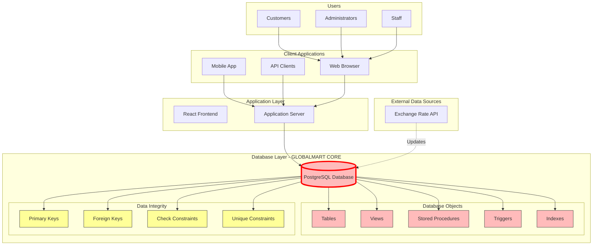

# 📘 Project Documentation Template: Advanced E-commerce Website

## 1. Project Overview
- **Project Name:**  
- **Version:**  
- **Date:**  
- **Prepared By:**  

### 1.1 Purpose  
Briefly describe the goal of the e-commerce platform (e.g., scalable online marketplace with advanced database features).

### 1.2 Scope  
Define what the project includes (e.g., product catalog, shopping cart, payment gateway, analytics) and excludes.

---

### 2. Database-Centric System Architecture
##  Overview
    
This document focuses on the database-centric architecture of GlobalMart, showing how users and applications interact with the database system we are designing in class. The architecture emphasizes the database as the core component, with all other elements serving as interfaces to the data.

## 1.High-Level Architecture Diagram  

### 2.2 Technology Stack  
- **Frontend:** React / Next.js / Tailwind CSS  
- **Backend:** Node.js / Express / NestJS  
- **Database:** PostgreSQL / MySQL / MongoDB (with Prisma ORM)  
- **Mobile:** Flutter / React Native  
- **Hosting/Deployment:** Docker, Kubernetes, Cloud provider (AWS/Azure/GCP)  

---

## 3. Database Design
### 3.1 ER Diagram  
*(Include entity-relationship diagram)*

### 3.2 Schema Overview  
| Table Name       | Description                          | Key Fields                  |
|------------------|--------------------------------------|-----------------------------|
| Users            | Stores customer & admin info         | user_id, email, password    |
| Products         | Product catalog                      | product_id, name, price     |
| Orders           | Customer orders                      | order_id, user_id, status   |
| Payments         | Transaction records                  | payment_id, order_id        |
| Inventory        | Stock management                     | product_id, quantity        |
| Reviews          | Customer feedback                    | review_id, product_id       |

### 3.3 Advanced Features  
- **Indexes & Optimization:** Full-text search, composite indexes  
- **Stored Procedures:** Automated stock updates, order validation  
- **Triggers:** Inventory decrement on purchase  
- **Partitioning:** Large tables (orders, logs) for scalability  
- **Backup & Recovery Plan:** Daily snapshots, disaster recovery strategy  

---

## 4. Functional Requirements
### 4.1 User Roles  
- **Customer:** Browse, purchase, review products  
- **Admin:** Manage products, orders, users  
- **Vendor (optional):** Add/manage own products  

### 4.2 Core Features  
- Product catalog with filters/search  
- Secure authentication & authorization  
- Shopping cart & checkout  
- Payment gateway integration  
- Order tracking & notifications  
- Review & rating system  
- Analytics dashboard  

---

## 5. Non-Functional Requirements
- **Performance:** Handle 10,000 concurrent users  
- **Scalability:** Horizontal scaling with load balancers  
- **Security:** SSL/TLS, hashed passwords, role-based access  
- **Availability:** 99.9% uptime SLA  
- **Compliance:** GDPR, PCI-DSS  

---

## 6. API Documentation
### 6.1 REST/GraphQL Endpoints  
- `GET /products` – Fetch product list  
- `POST /orders` – Create new order  
- `PUT /inventory/:id` – Update stock  
- `POST /auth/login` – User authentication  

### 6.2 Authentication  
JWT-based authentication with refresh tokens.

---

## 7. Testing & Quality Assurance
- **Unit Tests:** For database queries, API endpoints  
- **Integration Tests:** Checkout flow, payment gateway  
- **Load Testing:** Simulate high traffic  
- **Automated Testing Tools:** Jest, Cypress, Postman  

---

## 8. Deployment & CI/CD
- **Version Control:** GitHub/GitLab  
- **CI/CD Pipeline:** GitHub Actions / Jenkins  
- **Containerization:** Docker images for services  
- **Monitoring:** Prometheus, Grafana, ELK stack  

---

## 9. Maintenance & Support
- **Bug Tracking:** Jira / Trello  
- **Update Policy:** Monthly feature updates, weekly patches  
- **Documentation Updates:** With each release  

---

## 10. Appendices
- Glossary of terms  
- References  
- Change log  

---

👉 This template gives you a **professional, database-focused structure** for documenting your e-commerce project.  

Would you like me to also create a **ready-to-use ER diagram schema** (with tables and relationships) so you can plug it directly into your project?
