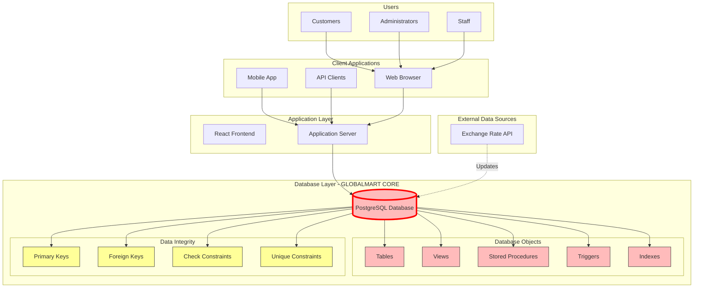
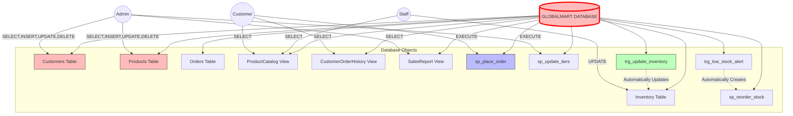
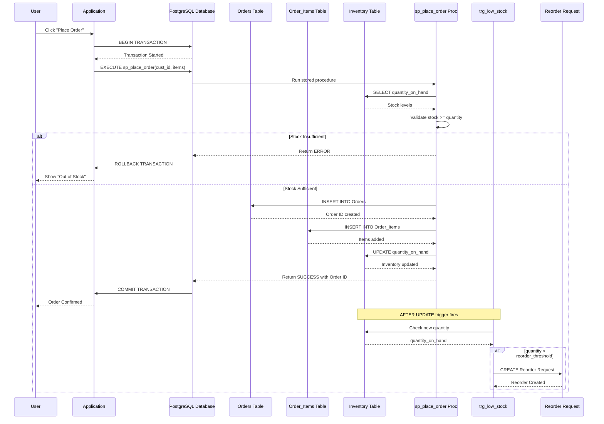

### 2. Database-Centric System Architecture

### Overview
This document focuses on the database-centric architecture of GlobalMart, showing how users and applications interact with the database system we are designing in class. The architecture emphasizes the database as the core component, with all other elements serving as interfaces to the data.

---

### High-Level Architecture Diagram



### Architecture Description

| Layer | Components | Database-Centric Role |
|-------|------------|----------------------|
| **Users** | Customers, Admins, Staff | Different roles with different database permissions |
| **Client Apps** | Web, Mobile, API | Interfaces that send SQL/queries or call stored procedures |
| **Application Layer** | React, Node.js | Thin layer that primarily passes data to/from database |
| **Database Core** | PostgreSQL | **Central component** - All business logic, data integrity, and rules enforced here |
| **External** | Currency API | Feeds data into database via scheduled jobs/triggers |

**Key Design Principle:** The database is the heart of the system. It enforces:
- Data integrity (PK, FK, Constraints)
- Business rules (Check constraints, Triggers)
- Complex calculations (Stored Procedures)
- Performance (Indexes)
- Security (Views, User permissions)

---

## 2.1 Database-Centric Use Case Diagram

### How Users Interact with Database Objects



### Database Object Access Matrix

| Database Object | Customer | Admin | Staff | Automatic (Trigger) |
|-----------------|----------|-------|-------|---------------------|
| Customers Table | No access | Full CRUD | No access | No |
| Products Table | SELECT only | Full CRUD | SELECT only | No |
| Orders Table | SELECT own only | Full CRUD | SELECT all | No |
| Inventory Table | No access | Full CRUD | UPDATE only | Yes (Triggers) |
| ProductCatalog View | SELECT | SELECT | SELECT | No |
| CustomerOrderHistory View | SELECT own | SELECT all | SELECT all | No |
| SalesReport View | No access | SELECT | No access | No |
| sp_place_order | EXECUTE | EXECUTE | No | No |
| sp_reorder_stock | No | EXECUTE | EXECUTE | Yes (Trigger) |
| sp_update_tiers | No | EXECUTE | No | Yes (Scheduled) |
| trg_update_inventory | - | - | - | ON Order INSERT |
| trg_low_stock_alert | - | - | - | ON Inventory UPDATE |

---

## 2.2 Database-Focused Activity Diagram

### Order Processing with Database Transactions

```mermaid
graph TD
    Start([Customer Starts]) --> A[Browse Products]
    A --> B[Add to Cart]
    B --> C{Ready to Checkout?}
    C -->|No| A
    C -->|Yes| D[Click Place Order]
    
    subgraph "DATABASE TRANSACTION - ACID Properties"
        E[Begin Transaction]
        E --> F[Call Stored Procedure: sp_place_order]
        
        F --> G[Check Inventory Table<br/>quantity_on_hand >= order_qty]
        G --> H{Stock Available?}
        H -->|No| I[Rollback Transaction<br/>Return Error]
        
        H -->|Yes| J[Insert into Orders Table]
        J --> K[Insert into Order_Items Table]
        K --> L[Update Inventory Table<br/>quantity_on_hand = quantity_on_hand - order_qty]
        
        L --> M{Any Error?}
        M -->|Yes| I
        
        M -->|No| N[Commit Transaction]
    end
    
    I --> O[Show "Out of Stock" Message]
    O --> A
    
    N --> P[Trigger: trg_low_stock_alert runs automatically]
    P --> Q{Inventory Below Threshold?}
    Q -->|Yes| R[Auto-create Reorder Request]
    Q -->|No| S[Send Order Confirmation]
    R --> S
    
    S --> T[Show Order Success Page]
    T --> V([End])
    
    style Start fill:#9f9,stroke:#333,stroke-width:2px
    style V fill:#f99,stroke:#333,stroke-width:2px
    style E fill:#ff9,stroke:#333,stroke-width:2px
    style N fill:#ff9,stroke:#333,stroke-width:2px
    style I fill:#f99,stroke:#333,stroke-width:2px
    style P fill:#bfb,stroke:#333,stroke-width:2px
```

### Database Transaction Explanation

| Step | Database Action | ACID Property | Tables Involved |
|------|----------------|---------------|-----------------|
| 1 | BEGIN TRANSACTION | Atomicity starts | - |
| 2 | Check inventory | Consistency check | Inventory |
| 3 | INSERT into Orders | Atomic operation | Orders |
| 4 | INSERT into Order_Items | Atomic operation | Order_Items |
| 5 | UPDATE Inventory | Atomic operation | Inventory |
| 6 | If error, ROLLBACK | Atomicity preserved | All |
| 7 | If success, COMMIT | Durability achieved | All |
| 8 | Trigger fires automatically | Business rule enforcement | Inventory |

---

## 2.3 Database-Centric Sequence Diagram

### Order Placement - Database Object Interactions




### Database Object Roles

| Database Object | Type | Role in Sequence |
|-----------------|------|------------------|
| **Orders Table** | Table | Stores order header information |
| **Order_Items Table** | Table | Stores individual line items |
| **Inventory Table** | Table | Tracks stock levels, updated by trigger |
| **sp_place_order** | Stored Procedure | Contains all order logic, runs in transaction |
| **trg_low_stock** | Trigger | Automatically fires after inventory update |
| **Database Transaction** | ACID | Ensures all-or-nothing order placement |

---

## 2.4 Database Component Diagram

### Components of the GlobalMart Database System

```mermaid
graph TB
    subgraph "DATABASE MANAGEMENT SYSTEM"
        DB[PostgreSQL Database Engine]
        
        subgraph "SCHEMA OBJECTS"
            direction TB
            T[Tables]
            V[Views]
            IX[Indexes]
            SQ[Sequences]
        end
        
        subgraph "PROGRAMMABILITY"
            SP[Stored Procedures]
            FN[Functions]
            TR[Triggers]
        end
        
        subgraph "DATA INTEGRITY"
            PK[Primary Keys]
            FK[Foreign Keys]
            CK[Check Constraints]
            UQ[Unique Constraints]
            DF[Default Values]
        end
        
        subgraph "SECURITY"
            USR[Users/Roles]
            PRM[Permissions]
            VW[Security Views]
        end
    end
    
    subgraph "TABLES DETAIL"
        CUST[Customers]
        PROD[Products]
        ORD[Orders]
        ORDI[Order_Items]
        INV[Inventory]
        WH[Warehouses]
        CURR[Currencies]
        EXR[Exchange_Rates]
        TIER[Customer_Tiers]
        ATT[Attributes]
        PRODA[Product_Attributes]
    end
    
    subgraph "VIEWS DETAIL"
        V1[CustomerOrderHistory]
        V2[ProductCatalog]
        V3[InventoryStatus]
        V4[MonthlySales]
        V5[CustomerTierBenefits]
    end
    
    subgraph "PROCEDURES DETAIL"
        P1[sp_place_order]
        P2[sp_reorder_stock]
        P3[sp_update_customer_tiers]
        P4[sp_apply_exchange_rates]
    end
    
    subgraph "TRIGGERS DETAIL"
        T1[trg_update_inventory]
        T2[trg_low_stock_alert]
        T3[trg_update_lifetime_value]
        T4[trg_audit_log]
    end
    
    DB --> T
    DB --> V
    DB --> IX
    DB --> SQ
    DB --> SP
    DB --> FN
    DB --> TR
    DB --> PK
    DB --> FK
    DB --> CK
    DB --> UQ
    DB --> DF
    DB --> USR
    DB --> PRM
    DB --> VW
    
    T --> CUST
    T --> PROD
    T --> ORD
    T --> ORDI
    T --> INV
    T --> WH
    T --> CURR
    T --> EXR
    T --> TIER
    T --> ATT
    T --> PRODA
    
    V --> V1
    V --> V2
    V --> V3
    V --> V4
    V --> V5
    
    SP --> P1
    SP --> P2
    SP --> P3
    SP --> P4
    
    TR --> T1
    TR --> T2
    TR --> T3
    TR --> T4
    
    style DB fill:#fbb,stroke:#f00,stroke-width:4px
    style T fill:#fbb,stroke:#333,stroke-width:1px
    style SP fill:#bbf,stroke:#333,stroke-width:1px
    style TR fill:#bfb,stroke:#333,stroke-width:1px
    style V fill:#bff,stroke:#333,stroke-width:1px
```



### Component Inventory

| Component Category | Components | Count | Purpose |
|-------------------|------------|-------|---------|
| **Tables** | Customers, Products, Orders, Order_Items, Inventory, Warehouses, Currencies, Exchange_Rates, Customer_Tiers, Attributes, Product_Attributes | 11 | Core data storage |
| **Views** | CustomerOrderHistory, ProductCatalog, InventoryStatus, MonthlySales, CustomerTierBenefits | 5 | Simplified data access |
| **Stored Procedures** | sp_place_order, sp_reorder_stock, sp_update_customer_tiers, sp_apply_exchange_rates | 4 | Complex business logic |
| **Triggers** | trg_update_inventory, trg_low_stock_alert, trg_update_lifetime_value, trg_audit_log | 4 | Automated enforcement |
| **Constraints** | Primary Keys (11), Foreign Keys (15+), Check (5+), Unique (5+) | 35+ | Data integrity |
| **Indexes** | On PKs, FKs, frequently queried columns | 15+ | Performance |

---

## 2.5 Database-Focused Technology Stack

### Complete Technology Stack (Database-Centric View)

| Layer | Technology | Version | Purpose | Database Integration |
|-------|------------|---------|---------|---------------------|
| **Database Engine** | PostgreSQL | 15.x | Primary relational database | ACID compliance, advanced SQL features, JSON support |
| **Database Design** | pgAdmin 4 | Latest | Visual database design and management | Direct schema manipulation, query execution |
| **Version Control** | Git + GitHub | - | Schema versioning | Track DDL changes, team collaboration |
| **ERD Design** | Draw.io / Lucidchart | - | Visual data modeling | Design tables, relationships, constraints |
| **SQL Development** | DBeaver | Latest | Universal SQL client | Write/test queries, view execution plans |
| **Database Utilities** | PostgreSQL pg_dump | 15.x | Backup and restore | Export/import schema and data |
| **Migration Tool** | PostgreSQL Migrations | - | Schema version control | Track and apply schema changes |


